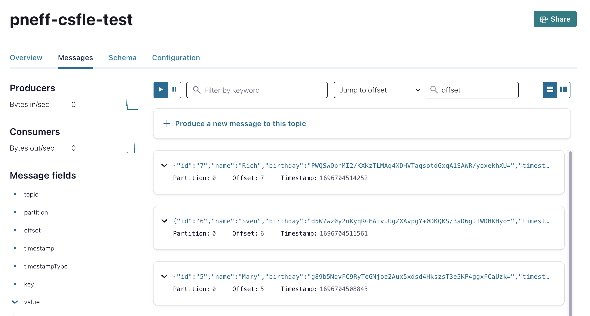

# Client-Side Field Level Encryption (CSFLE) with HashiCorp Vault

This repository provides a step-by-step demo of the Confluent Cloud feature [Client-Side Field Level Encryption](http://staging-docs-independent.confluent.io/docs-cloud/PR/2843/current/clusters/csfle/overview.html).
As of today, this feature is in Early Access Program.


## Prerequisites

* Confluent Cloud cluster with Advanced Stream Governance package
* For clients, Confluent Platform 7.4.2 or 7.5.1 are required.

## Goal

We will produce personal data to Confluent Cloud in the following form 
```
{
    "id": "0",
    "name": "Anna",
    "birthday": "1993-08-01",
    "timestamp": "2023-10-07T19:54:21.884Z"
}
```
However, we set up the corresponding configurations to encrypt the `birthday` field.
We then start a consumer with the corresponding configurations to decrypt the field again.

In order to have a realistic scenario, we do not produce and consume via the CLI but develop a
producer and consumer application with Kotlin.

## Create Tag

We first need to create a tag on which we apply the encryption later, such as `PII`.
As of today, we need to create the tag in the Stream Catalog first, see the [documentation](https://docs.confluent.io/platform/current/schema-registry/fundamentals/data-contracts.html#tags) of Data Contracts.

## HashiCorp Vault 
We need to start HashiCorp Vault locally via docker:

```shell
docker-compose up -d
```

We can then log in under `http://localhost:8200/` with `root-token`

Under enable new secret engine we create a transit and a key.


## Set up credentials and register schema

We register the schema with setting `PII` to the birthday field and defining the encryption rule

```shell

export KAFKA_CLUSTER_REST_ENDPOINT="<YOUR-REST-ENDPOINT>"
export KAFKA_CLUSTER_ID="<ID OF YOUR CLUSTER>"
export API_KEY="<Your Cluster API Key>"
export API_SECRET="<Your Cluster API Secret>"
export TOPIC="csfle-test-aabbccdd"
export SR_REST_ENDPOINT="<Schema Registry REST Endpoint>"
export SR_API_KEY="<put your SR API Key here>"
export SR_API_SECRET=":<put your SR API secret here>"
```

If you want to e.g. list your topics, you can use curl:

```shell
curl --request GET --url $KAFKA_CLUSTER_REST_ENDPOINT/kafka/v3/clusters/$KAFKA_CLUSTER_ID/topics -u "$API_KEY:$API_SECRET" | jq
```


Then we can create the schema:

```shell
curl --request POST --url "${SR_REST_ENDPOINT}/subjects/${TOPIC}-value/versions"   \
  --user "${SR_API_KEY}:${SR_API_SECRET}" \
  --header 'content-type: application/octet-stream' \
  --data '{
            "schemaType": "AVRO",
            "schema": "{  \"name\": \"PersonalData\", \"type\": \"record\", \"namespace\": \"com.csfleExample\", \"fields\": [{\"name\": \"id\", \"type\": \"string\"}, {\"name\": \"name\", \"type\": \"string\"},{\"name\": \"birthday\", \"type\": \"string\", \"confluent:tags\": [ \"PII\"]},{\"name\": \"timestamp\",\"type\": [\"string\", \"null\"]}]}",
            "metadata": {
            "properties": {
            "owner": "Patrick Neff",
            "email": "pneff@confluent.io"
            }
          }
    }' 
```
## Register Rule

```shell
curl --request POST --url "${SR_REST_ENDPOINT}/subjects/${TOPIC}-value/versions" \
  --user "${SR_API_KEY}:${SR_API_SECRET}" \
  --header 'Content-Type: application/vnd.schemaregistry.v1+json' \
  --data '{
        "ruleSet": {
        "domainRules": [
      {
        "name": "encryptPII",
        "kind": "TRANSFORM",
        "type": "ENCRYPT",
        "mode": "WRITEREAD",
        "tags": ["PII"],
        "params": {
           "encrypt.kek.name": "pneff-csfle-hashicorp",
           "encrypt.kms.key.id": "http://127.0.0.1:8200/transit/keys/csfle",
           "encrypt.kms.type": "hcvault"
          },
        "onFailure": "ERROR,NONE"
        }
        ]
      } 
    }'
```

We can check that everything is registered correctly by either executing
```shell
curl --request GET \
  --url "${SR_REST_ENDPOINT}/subjects/${TOPIC}-value/versions/latest" \
  --user "${SR_API_KEY}:${SR_API_SECRET}" | jq
```

or in the CC UI


## Producer configuration

### Gradle
We need to add
```shell
implementation("io.confluent:kafka-avro-serializer:7.4.2")
implementation("io.confluent:kafka-schema-registry-client-encryption-hcvault:7.4.2")
```

### Producer
We need to adjust the configuration by adding
```kotlin
// Encryption
settings.setProperty("rule.executors._default_.param.token.id", "root-token")

// Required since we manually create schemas
settings.setProperty("use.latest.version", "true")
settings.setProperty("auto.register.schemas","false")
```

We continuously produce data with the encryption (the topic `pneff-csfle-test` needs to be created before) by executing
```
./gradlew run
```

We can see in the logs that everything is working fine
```shell
[kafka-producer-network-thread | producer-2] INFO  KafkaProducer - event produced to pneff-csfle-test
```

or check the encrypted field messages in the CC UI



## Consumer

We configure the consumer with the corresponding configurations
and just log the consumed event.
We can run it again with
```
./gradlew run
```

It may take a few seconds but then we can see all events with decrypted `birthday`
field:

```shell
[main] INFO  KafkaConsumer - We consumed the event {"id": "0", "name": "Anna", "birthday": "1993-08-01", "timestamp": "2023-10-07T20:48:02.624Z"}
[main] INFO  KafkaConsumer - We consumed the event {"id": "1", "name": "Joe", "birthday": "1996-09-11", "timestamp": "2023-10-07T20:48:18.005Z"}
```
